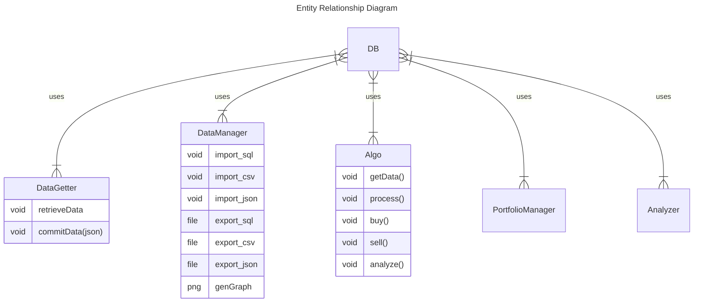

```
mysql -h 127.0.0.1 -P 3308 -u my_user -p quant
```

### Sample Queries
```
CREATE TABLE ibm_ohlcv (ticker varchar(255), date DATE, open float(2), high float(2), low float(2), close float(2), volume int);

INSERT INTO ibm_ohlcv (ticker, date, open, high, low, close, volume) VALUES ("ibm", "2023-09-17", 0.00, 0.01, 0.002, 0.003, 69);

SELECT * FROM ibm_ohlcv WHERE ticker="ibm";
```

```
CREATE TABLE intraday_ohlcv_IBM (ticker varchar(255), datetime DATETIME, open float(2), high float(2), low float(2), close float(2), volume int, refresh DATETIME);

INSERT INTO intraday_ohlcv_IBM (ticker, datetime, open, high, low, close, volume, refresh) VALUES ("IBM","2023-09-15 19:55:00", 146.0300, 146.0300,146.0300, 146.0300,1,"2023-09-17 16:18");
```


```
python3 -m pip install mysql-connector
python3 -m pip install jupyter
python3 -m pip install SQLAlchemy
```
```
jupyter notebook
```

### Sample API requests
```
https://www.alphavantage.co/query?function=TIME_SERIES_INTRADAY&symbol=IBM&interval=5min&apikey=demo
```

# Resources
- https://medium.com/@chrischuck35/how-to-create-a-mysql-instance-with-docker-compose-1598f3cc1bee
- https://stackoverflow.com/questions/1650946/mysql-create-table-if-not-exists-error-1050