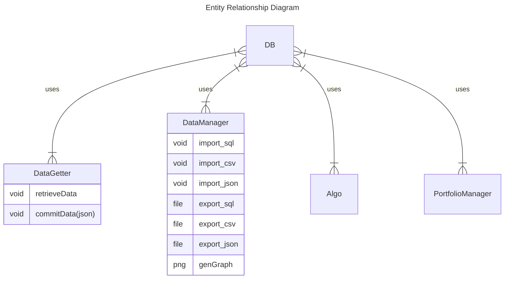

```
mysql -h 127.0.0.1 -P 3308 -u my_user -p quant
```

```
CREATE TABLE ibm_ohlcv (open float(2), high float(2), low float(2), close float(2), volume int );

INSERT INTO [TODO]
```

# Resources
- https://medium.com/@chrischuck35/how-to-create-a-mysql-instance-with-docker-compose-1598f3cc1bee