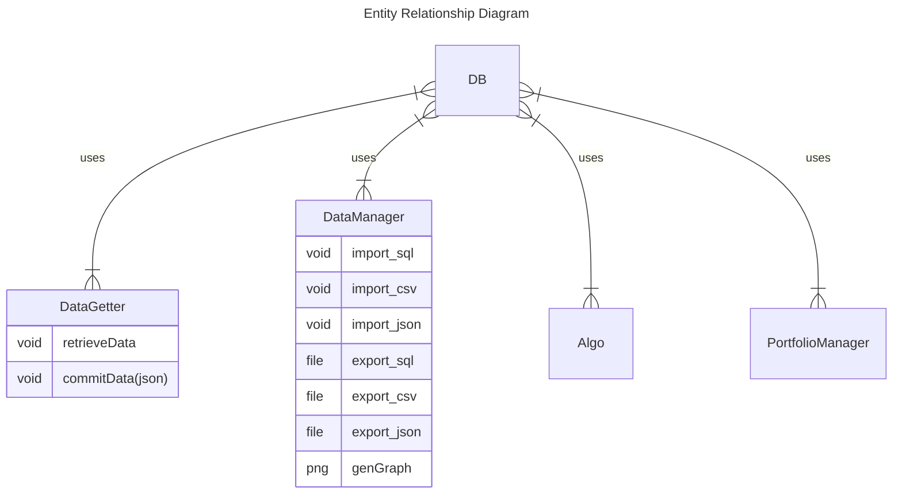

```mermaid
---
title: Entity Relationship Diagram
---
erDiagram
  DB }|--|{ DataGetter : uses
  DataGetter {
    void retrieveData
    void commitData(json)
  }
  DB }|--|{ DataManager : uses
  DataManager{
    void import_sql
    void import_csv
    void import_json
    file export_sql
    file export_csv
    file export_json
    png genGraph
  }
  DB }|--|{ Algo : uses
  DB }|--|{ PortfolioManager : uses
```

# Resources
- https://medium.com/@chrischuck35/how-to-create-a-mysql-instance-with-docker-compose-1598f3cc1bee